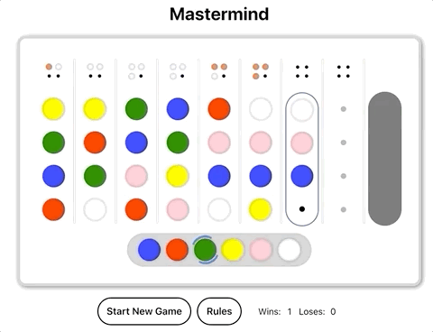

# Mastermind



Mastermind is a [code-breaking game](<https://en.wikipedia.org/wiki/Mastermind_(board_game)>). The objective of the game is to guess the exact colors and positions of the secret.

This is a personal project so that I could play around with React, Typescript and React Testing Library.

You can check the game live [here](https://mastermind-online.herokuapp.com).

## Before you start

You'll need [NODE.js](https://nodejs.org/en/download/) and [NPM](https://www.npmjs.com/get-npm) installed. Then run this in the project directory:

```sh
npm install
```

## To run the project

In the project directory, you can run:

```sh
npm start
```

This runs the game in development mode.<br>
Open [http://localhost:3000](http://localhost:3000) to view it in the browser.

To run tests, run:

```sh
npm test
```

> This project was bootstrapped with [Create React App](https://github.com/facebook/create-react-app).
